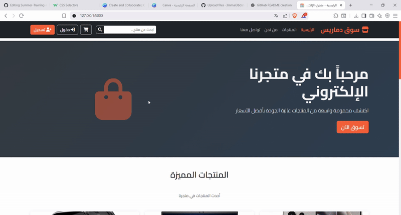

<h1 align="center">🛒 Summer-Training-FCI-2025 — Arabic Flask E-Commerce</h1>

<p align="center">
  A clean, modern, Arabic-first e-commerce website built with <strong>Python Flask</strong> for Summer Training (FCI 2025).<br/>
  Browse products, manage a cart, and place orders for electronics & accessories.
</p>

<p align="center">
  <!-- Shields -->
  <a href="https://www.python.org/"></a>
  <a href="https://flask.palletsprojects.com/"></a>
  <a href="https://getbootstrap.com/"></a>
  
  
  <a href="https://github.com/your-username/Summer-Training-FCI-2025/stargazers"></a>
</p>

<p align="center">
  <a href="#-live-demo">Demo</a> •
  <a href="#-features">Features</a> •
  <a href="#-quickstart">Quickstart</a> •
  <a href="#-roadmap">Roadmap</a> •
  <a href="#-contributors">Contributors</a>
</p>

---

## ✨ Highlight Reel

- 🇸🇦 **Arabic-first UX** with RTL layout.
- 🛍️ **Products & categories**, with search and filters.
- 🛒 **Cart** (add / update / remove), **orders** flow.
- 📱 **Responsive** (Bootstrap) — great on mobile/desktop.
- 🗄️ **SQLite/MySQL** support via config.
- 🧪 Ready for **extensions** (auth, payments, admin).

---

## 🎬 Live Demo

  

---

## 📦 Tech Stack

- **Backend:** Python (Flask), Jinja2  
- **Frontend:** HTML, CSS, Bootstrap, JavaScript  
- **Database:** SQLite (default) or MySQL  
- **Tools:** Git/GitHub, virtualenv, pip  

---

## 📂 Project Structure

Summer-Training-FCI-2025/
├─ app.py # Flask app entry
├─ models.py # ORM/models (SQLAlchemy or raw)
├─ requirements.txt # Python deps
├─ .env.example # Sample environment variables
├─ templates/ # Jinja templates
│ ├─ base.html
│ ├─ index.html
│ ├─ product_detail.html
│ └─ cart.html
├─ static/ # CSS, JS, images for the site
│ ├─ css/
│ ├─ js/
│ └─ images/
├─ assets/ # README media (demo.gif)
└─ README.md

---

## ⚙️ Quickstart

```bash
# 1) Clone
git clone https://github.com/your-username/Summer-Training-FCI-2025.git
cd Summer-Training-FCI-2025

# 2) Create & activate venv
python -m venv venv
# Windows
venv\Scripts\activate
# Linux/Mac
source venv/bin/activate

# 3) Install deps
pip install -r requirements.txt

# 4) Configure env
cp .env.example .env
# open .env and set SECRET_KEY and DATABASE_URL

# 5) Run
flask run
# open http://127.0.0.1:5000
```
---

## 🗺️ Roadmap
Authentication (signup/login)

Admin dashboard (CRUD products, orders)

Payments (Stripe/PayPal)

Inventory management

Arabic ↔ English toggle (i18n)

---

## 👥 Contributors
Ammar Abdalkber — Full Stack & Docs

Ahmed Rabee — front End

Ahmed Khalifa — Data Base

Taha Sabry — Testing

Ahmed Khulf — Ai Effectors

Hazem Ali — DB & Frontend

---

## 📄 License
MIT © 2025 — Summer Training FCI Team
Feel free to use and modify for educational purposes.

## Acknowledgements
Flask, Bootstrap, Jinja2, and the open-source community.
Summer Training — Faculty of Computers & Information (2025).
